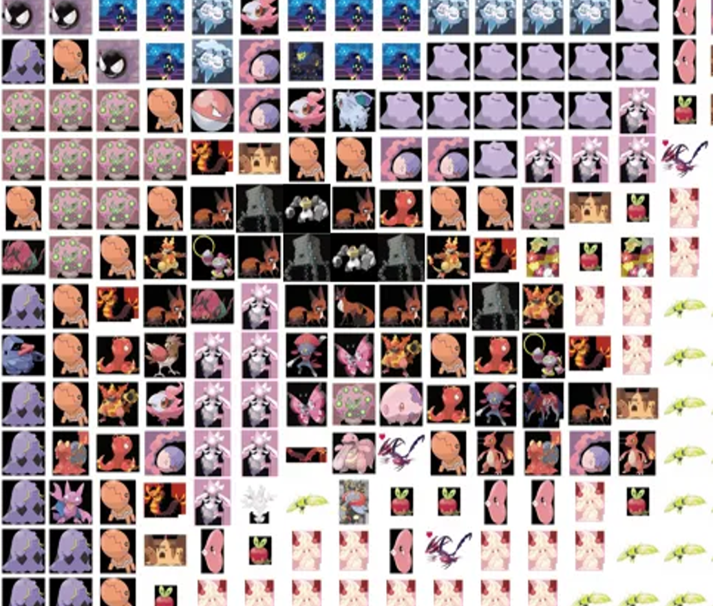

# Pokémon Mosaic Generator
Transform your images into stunning Pokémon-themed mosaics!

  <table>
    <tr>
      <td align="center"></td>
      <td align="center"></td>
      <td align="center"></td>
    </tr>
    <tr>
      <td align="center"><b>Original</b></td>
      <td align="center"><b>Output</b></td>
      <td align="center"><b>Zoom in</b></td>
    </tr>
  </table>

Live Demo:https://huggingface.co/spaces/dionjin/PokemonMosaicGenerator

Image source:https://www.kaggle.com/datasets/arenagrenade/the-complete-pokemon-images-data-set
